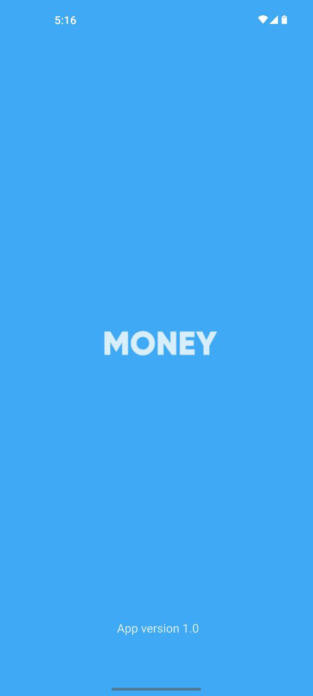
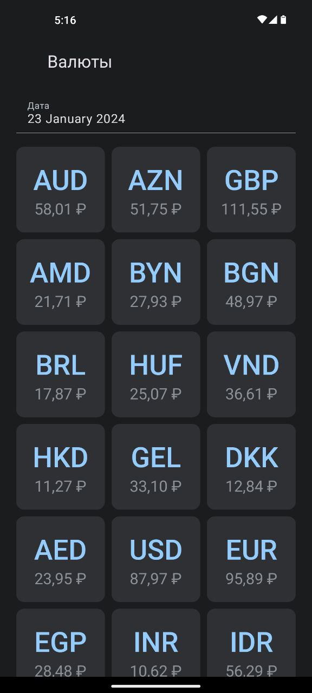
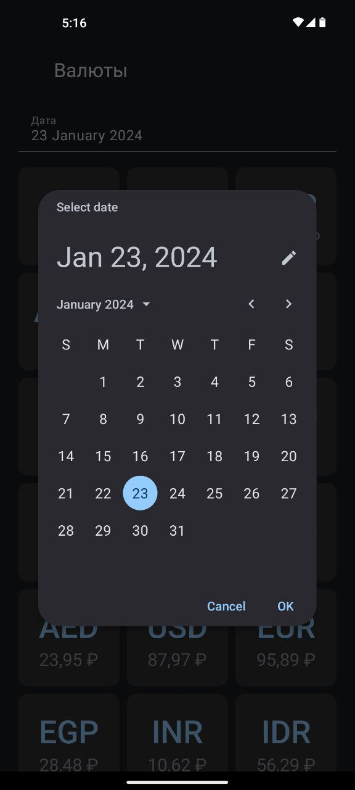
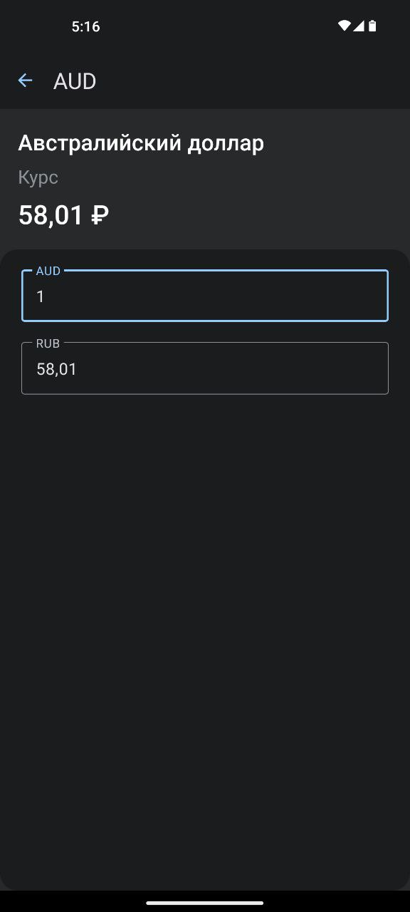
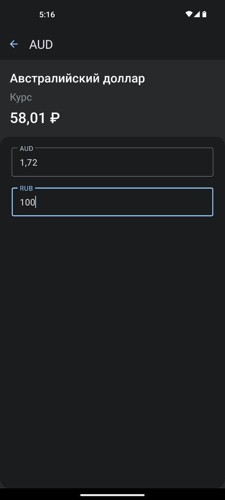

# Тестовое задание - обозреватель и конвертер курса валют
# Скриншоты приложения
| Splash Screen | Главный Экран | Календарь выбора даты | Экран детальной информации | Конвертер валют |
| ------------- | ------------- | ------------- | ------------- | ------------- |
|   |  |   |  |  |
# Описание
### Описание приложения
> В приложении присутствуют 2 экрана: Экран со списком валют, Детальная информация о валюте
> #### Экран со списком валют:
>> + Календарь выбора даты
>> + Список валют
> #### Детальная информация о валюте:
>> + Кодовое обозначение валюты
>> + Полное наименование валюты
>> + Текущий курс
>> + Два поля для конвертации
# Примечания
> + Обращение к API происходит один раз при запуске приложения
> + Если в базе данных уже есть информация о валюте на текущую дату - запись в базу данных не происходит
> + Добавлена анимация при навигации и обновлении состояния главного экрана
> + Присутствует темная тема
# О проекте
> + Архитектура - MVVM + CleanArchitecture + SingleActivity
> + Другие паттерны: Singlton, Observer
> + Технологии: Room, Hilt, Retrofit2, Gson, Navigation component, Kotlin Coroutines, CoroutineFlow, ViewBinding, SplashScreen API
